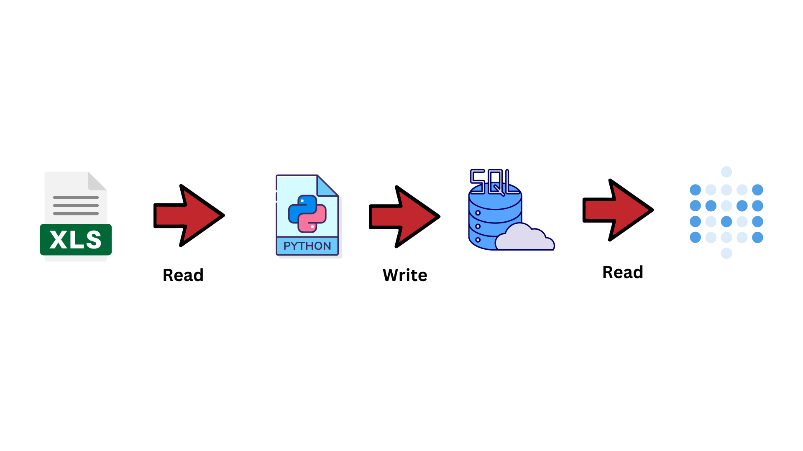

# How to used this repo :
1. Install Docker (https://docs.docker.com/engine/install/)
2. Open docker application
3. Open terminal in current directory
4. put command : docker-compose up -d
5. open : http://localhost:3000/ in your browser

# Services that we used to created this project

### This project used docker with 4 services :
1. Jupyter Notebook -> Create ETL from excel file to Database
2. Pgadmin -> Manage postgress
3. Postgress -> Our Database
4. Metabase -> Our BI Tools

