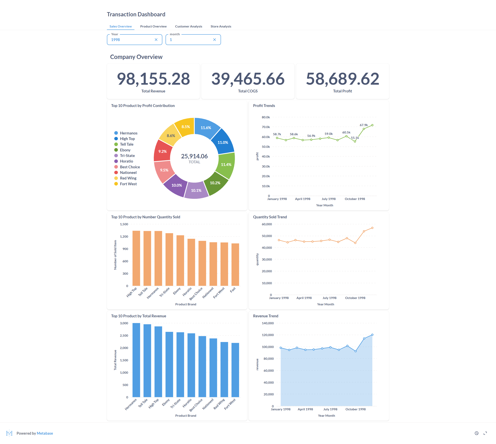
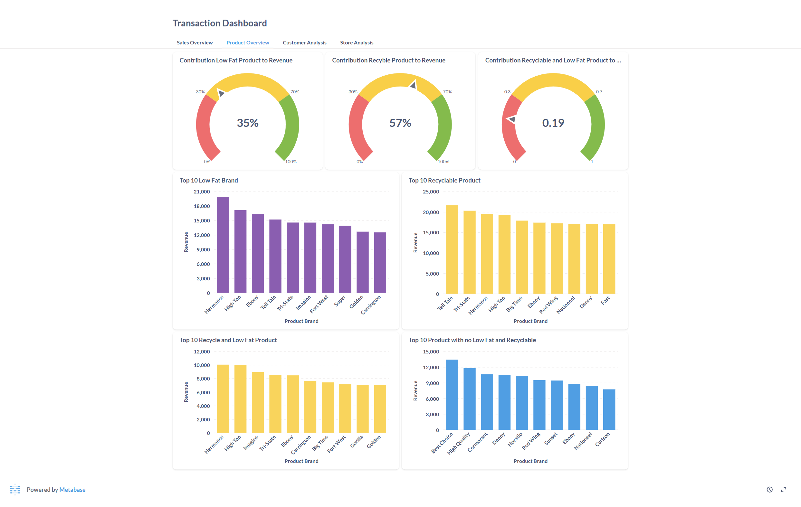

# How to used this repo :
1. Install Docker (https://docs.docker.com/engine/install/)
2. Open docker application
3. Open terminal in current directory
4. put command : docker-compose up -d
5. open : http://localhost:3000/ in your browser

# Services that we used to created this project :

### This project used docker with 4 services :
1. Jupyter Notebook -> Create ETL from excel file to Database
2. Pgadmin -> Manage postgress
3. Postgress -> Our Database
4. Metabase -> Our BI Tools

### Step by Step Process :
1. File Transaksi.xlsx read with pandas (python library) as dataframe
2. Dataframe will be load to database
3. Metabase will be read data from database

# Explanation from the data

## Company Overview :

1. Based on the picture, there is a significant move in November.
2. Based on the picture, the brand contributing the most to revenue and profit is Hermanos. However, in terms of quantity sold, Hermanos is not the highest-selling brand.

## Product Overview:

Most customer care with environment but not their healthy because we can see 53% recycle product contribute to total sales but only 35% low fat contribute to total sales 

