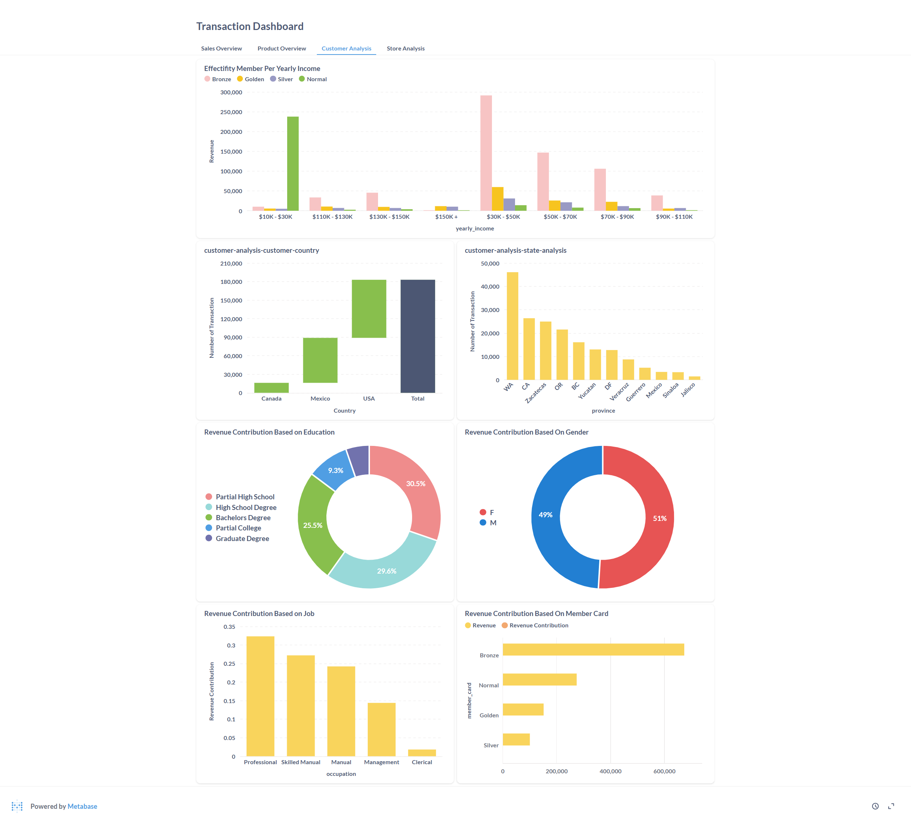
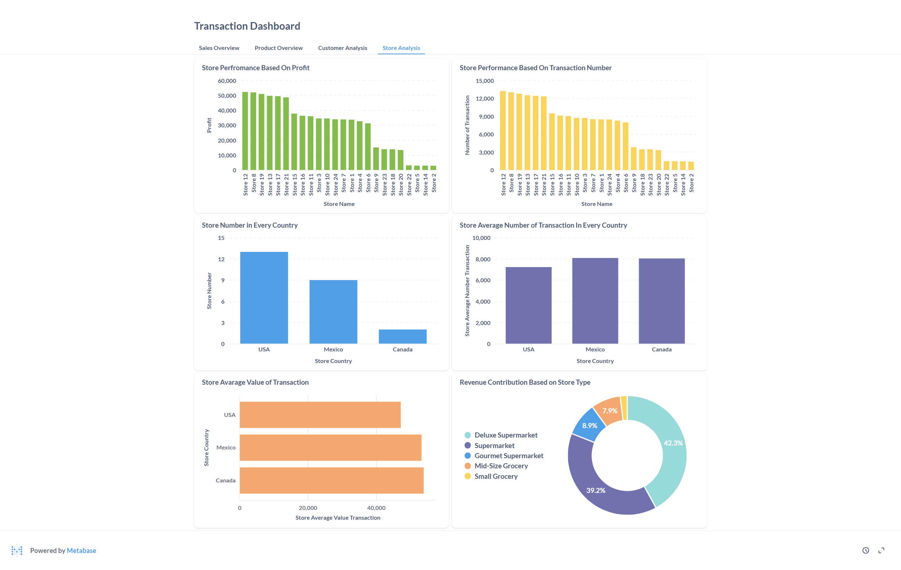

### This repo own by Arseno Feri Alzahabi (

# How to used this repo :
1. Install Docker (https://docs.docker.com/engine/install/)
2. Open docker application
3. Open terminal in current directory
4. put command : docker-compose up -d
5. open : http://localhost:3000/ in your browser

# Services that we used to created this project :

### This project used docker with 4 services :
1. Jupyter Notebook -> Create ETL from excel file to Database
2. Pgadmin -> Manage postgress
3. Postgress -> Our Database
4. Metabase -> Our BI Tools

### Step by Step Process :
1. File Transaksi.xlsx read with pandas (python library) as dataframe
2. Dataframe will be load to database
3. Metabase will be read data from database

# Explanation from the data

## Company Overview :

1. Based on the picture, there is a significant move in November.
2. Based on the picture, the brand contributing the most to revenue and profit is Hermanos. However, in terms of quantity sold, Hermanos is not the highest-selling brand.

## Product Overview:

Most customers care about the environment but not their health, as 53% of sales come from recycled products, while only 35% come from low-fat products. 

## Customer Overview :

1. Membership program not effective for customers with income between $10K - $30K/year.
2. Bronze membership is the most effective membership program
3. US Customer is the most contribut to the revenue
4. Customer education had negative correlation in revenue
5. The professional customer category has the most significant impact on revenue.

## Store Overview :

1. The best store is Store 12
2. The USA store contributed the most revenue, but the best performance compared to average revenue came from the store in Canada.
3. Deluxe Supermarket and Super Supermarket had better performance than others.

# Strategic Purposes

1. Add more stores in Canada because it has better potential than other countries. However, Canada currently has the fewest number of stores.
2. We should push promotions for the bronze membership because the bronze membership has made a significant contribution to the revenue
3. We should focus on customers with lower levels of education because they have contributed the most to our revenue.
4. Please add a more environmentally friendly brand to the list because our client cares about the environment.

